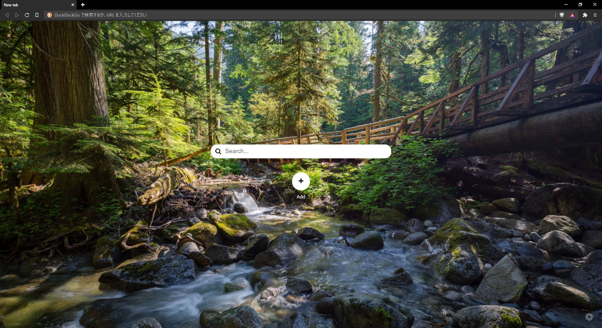

# Simple Newtab
A chrome extension to customize your new tab page simply.  

  

I recently started using Brave browser, but it's new tab page was not for me.  
I like a simple new tab page like Chrome browser, so I try to create this extension similar to that.  

I developed it with Next.js framework, but I think the choice was wrong.  
The file size of the Next.js application is about 20 MB that is huge in this kind of extensions.  

From this, I felt using Next.js for a small project is like fastening 1 sheet of paper by spear.  